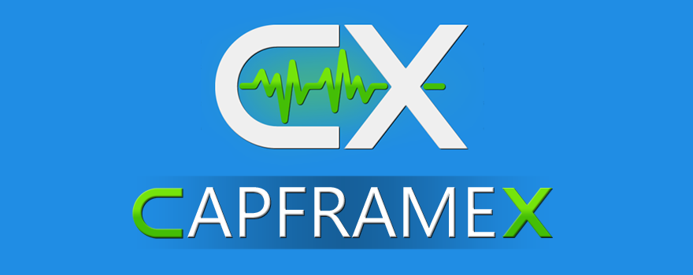
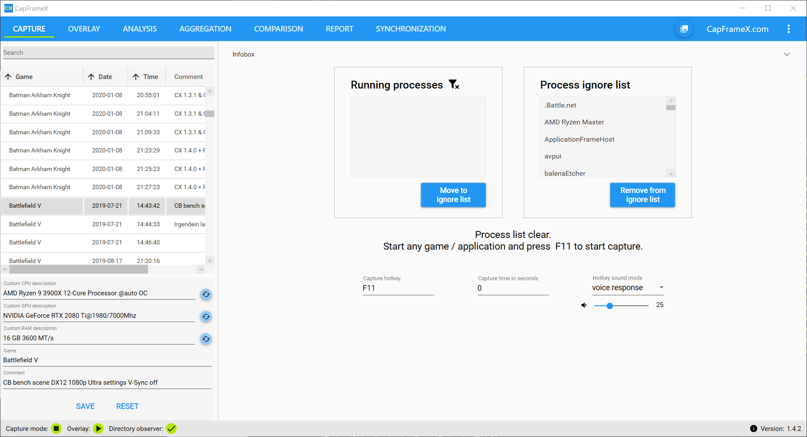
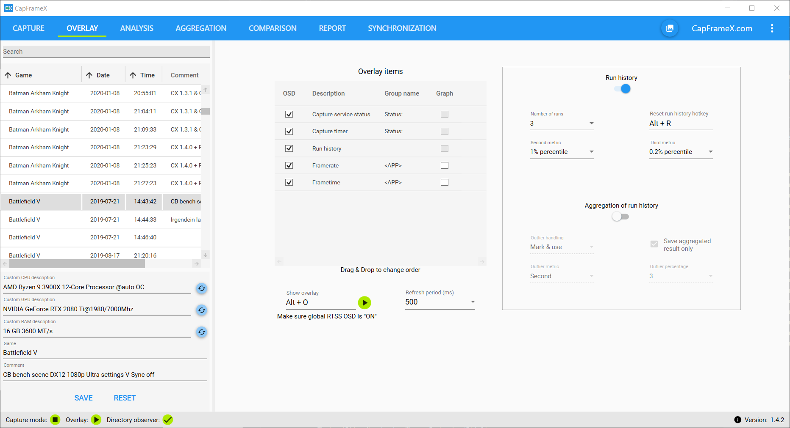
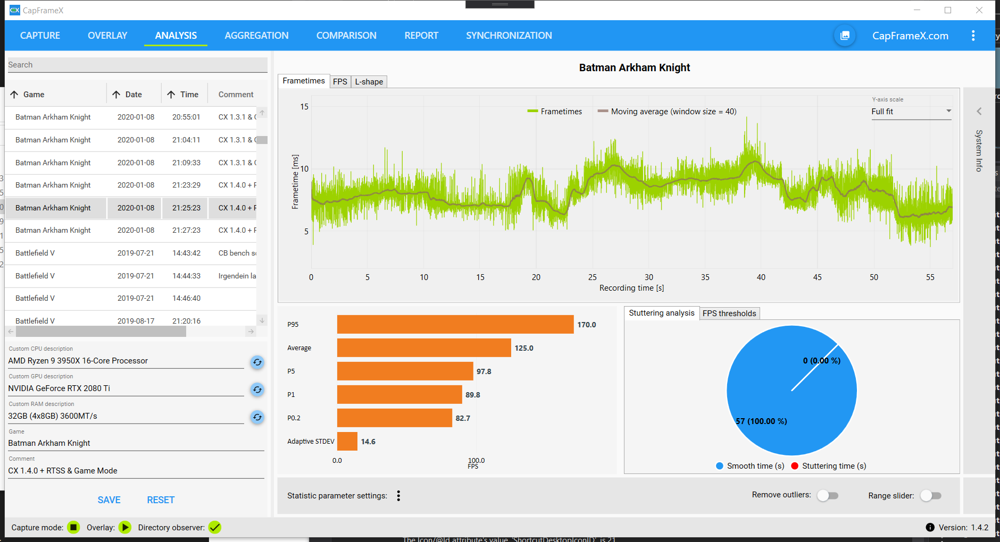
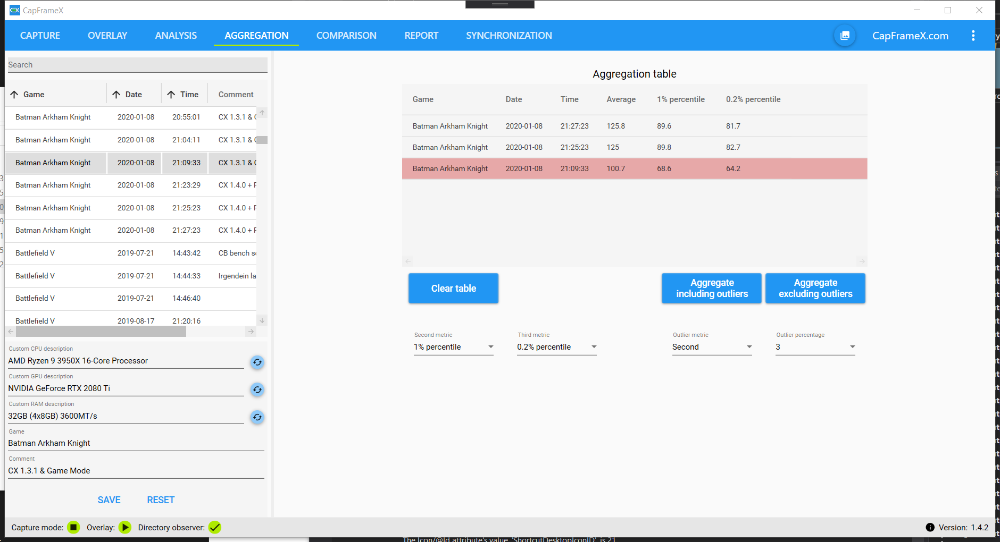
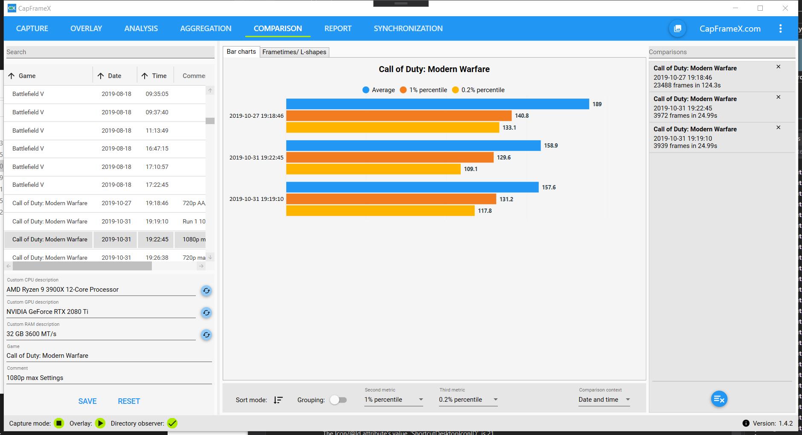
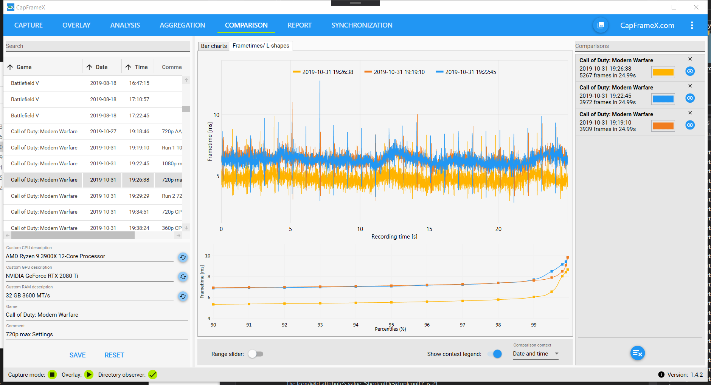
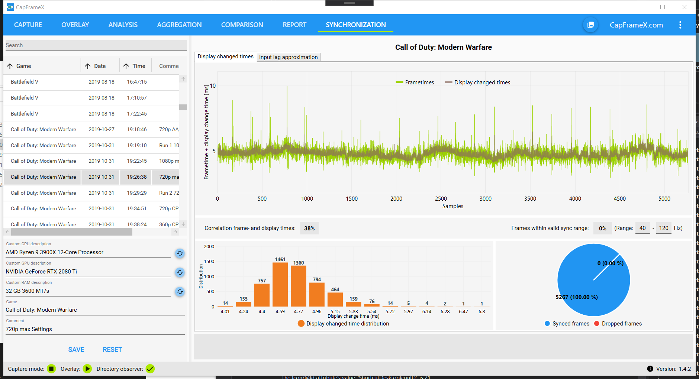
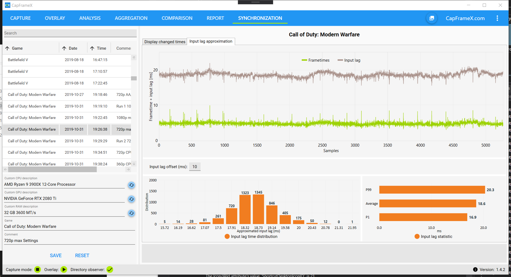
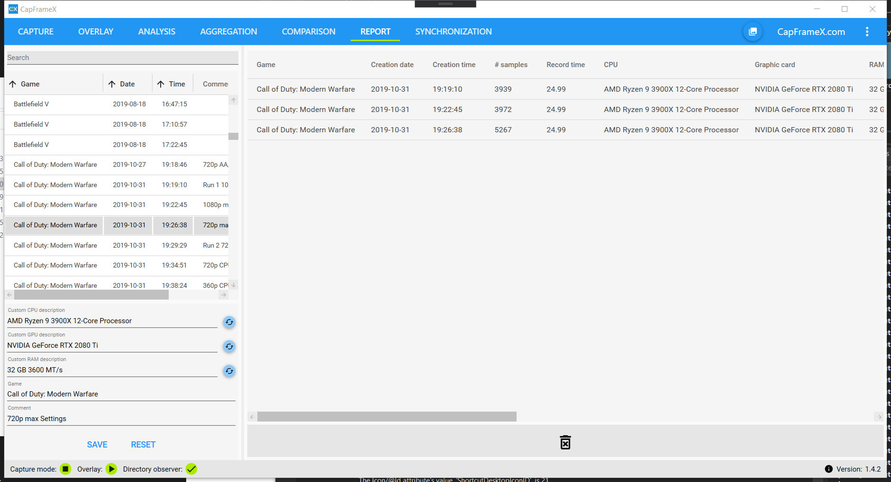

# CapFrameX
Frametimes capture and analysis tool compatible with most common 3D APIs

# Special thanks to
Sven Bauduin for logo and text design

# Remark in our own intererst
If you are a reviewer or a youtuber using CapFrameX to get your data, please mention us and link to our software.
If you want to use images of the CapFrameX analysis, please use the built in screenshot function so that our logo and name gets added to the images.

# Release
Download link: https://github.com/DevTechProfile/CapFrameX/releases

# Capture frametimes

# Overlay

# Analysis

# Aggregation

# Comparison

# Synchronization (G-Sync, FreeSync, Input lag)

# Report table (Excel)

# Instruction manual
Learn how to use CapFrameX.

## Record list
This list is always located at the left section, regardless of the view you're currently in.

It constantly observes the output directory so every capture will show up here as soon as the capture has finished.
This also includes every OCAT or PresentMon capture you put into that directory.

At the bottom of that list you can see and change the CPU, GPU and RAM description and add a custom comment to every capture.
Also you can edit the game name, since the process name is used as default. This gets saved in a textfile that is being compared with a list we update with every new version of CapFrameX to add new games that aren't already on your list. 

## Global Navigation Bar
Located at the top
Contains all the different views, a screenshot button, a direct link to the CX github page and an options menu. 
The screenshot button takes a screenshot of the current view excluding the record list.

## Options
* Moving average window size = The number of frames that are used for the average line in the frametime chart.(Analysis View)
* Stuttering factor = The factor a frametime has to be above average to be counted as stutter.(Analysis View)
* Observed directory = The directory in which your captures are saved and also where you can put your OCAT/PresentMon captures.
* FPS values rounding digits = The number of decimals for the FPS values
* Screenshot directory = The directory in which your screenshots are saved.
* Hardware info source = What will be written into the capture file as your CPU, GPU and RAM config.  
  Automatic detection: What's delivered by the system  
  Custom description: What you write into the text boxes below  

## Capture view
Here you can set your capture hotkey, the capture time(0=unlimited) and the response sounds.  
An info text always informs you what's going on with the capture service and also tells you what to do in certain situations.
For more detailed information about the capture events, you can take a look into the infobox which can be expanded from the top.

## How to make a capture
The process you want to capture has to be present in the "Running processes" list. This list automatically lists all running processes from which frametimes can be captured.

For the easiest way of just getting into a game and pressing the hotkey to start a capture, this list may only contain one single process, otherwise the service won't know which process you want captured.
If you have more than one process detected, you can still select the one you want and capturing will work just fine.
However you wouldn't want to tab out of your game to do this. This is where the ignore list comes into play.

With the arrow buttons you can add or remove any process from the ignore list, the ideal scenario is a completely empty running processes list at the start of CapFrameX.
With this, you can just start your game and since it'll be the only process in the list, just push the hotkey.

The ignore list already includes many of the most common processes and, just like the list for the game names, gets updated with our ignore list with every new Version of CapFrameX.

## Analysis View
This is where you can analyse the captures you made one by one.

For the graphs you can choose between frametime graphs, FPS graphs and L-shapes.  
Below that you have your performance parameters like min, max, avg and percentiles on the left.  
On the right you have two tabs, the first one is a pie chart which shows the amount of time you had stuttering (frametimes above 2.5x average(default)), the second one is a diagramm where you can see how many frames were below or above specific FPS thresholds.  
At the bottom is a toolbar where you can change the performance parameters, remove unusual outliers from the graphs and activate a range slider.  
On the very right of the page, there is also a "System info" expander which shows all the HW and SW information available for the selected benchmark.

## Overlay view
Contains the settings for the items displayed in the OSD aswell as the settings for a run history and the aggregation function.  

Left side  
Overlay items list where you can set the items you want to see in the OSD and change their order by Drag&Drop. Items with the same group name will be displayed within a single line.
Overlay hotkey to show or hide CX items in OSD. This doesn't hide RTSS completely like the Afterburner hotkey does. If you have AB or any other App that uses RTSS running together with CX, only CX items will disappear.  

Right side  
Run history to set a number of runs for which you get a simple analysis directly in the OSD. If the history is full, any additional run will replace the oldest one.  
Aggregation to combine the runs in the history to a single record file once the history is full, while marking outliers within the history.  
This doesn't take the calculated performance parameters of each record file and calculates an average out of them. It takes the raw frametimes of each record file and puts them into a new file, calculating every parameter based on that set of frametimes.  

Aggregation outlier handling: A full history is checked for outliers using the median of a selectable metric and an also selectable percentage value. From there you can choose between two modes:  
	"Mark & use": Outliers are marked, but all runs will be used for the aggregation.  
	"Mark & replace": If outliers exist, you have to do additional runs to replace them. Aggregation triggers when you have a full history without outliers. 

## Comparison View
Here you can compare multiple records.  
With a double-click from the record list you can add the captures to the comparison list and with a click on the comparison list entry you can select them in the record list. With the button at the end you can remove them all from the list.

The first tab shows you the records as bar charts.  
If you compare records from just a single game, this game is set as a title above the diagramm. If you compare records from multiple games, the names are labeled on the bars.
In addition you have an adjustable context for each record.  
At the bottom is a toolbar where you can change the sorting and adjust the displayed metrics aswell as the context.  

The "Grouping" toggle switches between two sorting modes:  
off-> all records are sorted by FPS  
on-> records are sorted by game, then by FPS  

The second tab shows you the frametime graphs and L-shapes.  
You can highlight the graphs with a mousover in the comparison list and also change their color or hide them.
The toolbar now shows you the options to activate the range slider and the context legend for the frametime graphs. The context setting is shared between the two tabs.

## Chart control
| Action | Gesture |
| --- | --- |
Pan | Right mouse button, arrow keys(+ Ctrl = slow pan) |
Pan(X-axis) | Shift + right mouse button |
Pan(Y-axis) | Ctrl + right mouse button  |
Zoom | Mouse wheel |
Zoom(X-axis) | Shift + mouse wheel |
Zoom(Y-axis) | Ctrl + mouse wheel |
Zoom by rectangle | Middle mouse button |
Reset | Left or middle mouse button double-click, ‘A’, Home |
Show ‘tracker’ | Left mouse button |
Copy values| Right mouse button context menu |

You can also zoom/pan a single axis by positioning the mouse cursor over the axis before starting the zoom/pan.  
This manual is also available through the context menu.

## Report view
This is a simple view where you can add your records to see all the relevant parameters all at once. You can also just copy them with a right-click to add them into any other programm. This is also possible for the graphs and performance parameters in the single record view.

## Synchronization view
This view shows you the quality of your synchronization methods like FreeSync or G-Sync as well as an approximated input lag analysis. 

Tab "Display changed times" 
If sync methods are working properly, the lines for "frametimes" and "Display changed times" should align pretty well, this means your monitor works at the adaptive refresh rate of your GPU.  
Below the Graph you can see two percentage values. The first one shows the correlation of frame- and display time, the second one shows the amount of frames within valid sync range(that you can enter next to it).  
At the bottom you can see the distribution of the refresh times and beside it another pie chart which shows the number of dropped frames.  

Tab "Approximated input lag"  
Using various data from PresentMon, we can give a fairly accurate approximation on the input lag.  
Note, that this doesn't include the additional latency from your mouse/keyboard or your monitor. For that we've included a box where you can type in an offset based on your hardware. We've chosen 10ms as the default.  
This input lag is shown in the graph and in the distribution below as well as a small bar chart for the average and pecentile values.  

## Export options (context menu)
* Analysis: frametime values (f), frametime points (t, f(t)), FPS values, quantiles
* Report: parameter table
* Synchronization: display changed times(dc), histogram data

# Requirements
* .NET 4.7.2

# Build requirements
* MS Visual Studio 2019 only (Community Edition)
* WiX V3.11.1
* WiX Toolset Visual Studio 2019 Extension
* WiX Toolset and VS Extension: http://wixtoolset.org/releases/

# Dev roadmap
* logging CPU and GPU usage to make them available as additional graphs

